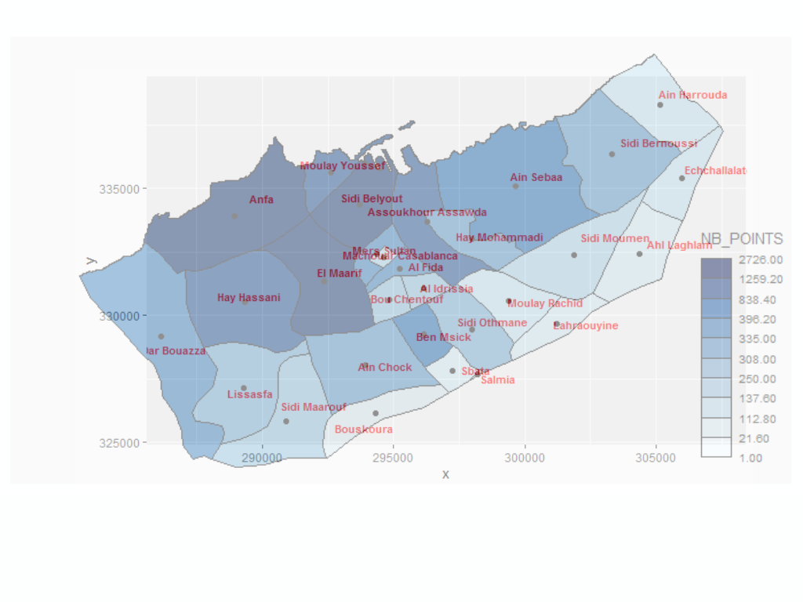

# Projet Rythmes Urbains Heetch

## Contexte
- **Entreprise**: Heetch
- **Source des données**: L'entreprise Heetch récupère les données de ses chaufeurs ont leur application ouverte
- **Objectif**: savoir quel est la différence de trafic entre tel jour et tel autre (trafic = fct(temps))

## Démarche
On organisons le travail en 2 parties. La première identifie l'heure de pointe et les quartiers principaux à ces heures de pointes. Le seconde, 

## Définitions
- **Heure de pointe**: Heure à laquelle il y a des fortes concentrations de chauffeurs dans certaines villes

## Partie 1: déterminer une heure de pointe par quartier

### Data Loading
#### fichier Rmd
- [loadHeetch.Rmd](./workA/loadHeetch.Rmd)
#### Résumé
- récupérer 
    - les données des chauffeurs ``heetchmarchcrop.Rds`` (un ``sf`` contient des points) 
    - et la répartition géographique des quartiers de casa ``casaneib.geojson``
- transformer les données vers une projection correspondant à Casablanca (``crs=26191``)
- Faire une intersection entre les deux bases de données afin 
- générer un fichier final (``heetchmarchcropwithneib.Rds``) qui contient 
    - les données de ``heetchmarchcrop.Rds`` en projection (``crs=26191``) 
    - le quartier où le point a été retrouvé

### Mapping peak hours: Determiner une heure de pointe par quartier
- les details sont dans le fichier: [task1.Rmd](./workA/main.Rmd) avec une vue [html](./workA/)

Nombre de points en fonction du quartier

## Partie 2: OD: Determiner les flux 

### Task1: OD_jour
- les details sont dans le fichier: [OD_jour](./workB/rendu/OD_jour.Rmd) avec une vue [html](./workB/rendu/OD_jour.html)

### Task2: OD_week vs week-end
- les details sont dans le fichier: [OD_week](./workB/rendu/OD_week.Rmd) avec une vue [html](./workB/rendu/OD_week.html)
