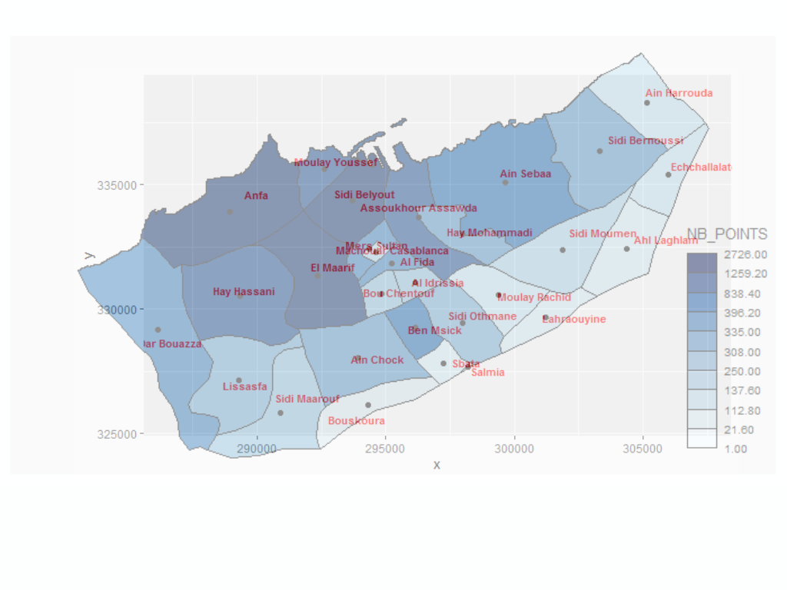

```{r setup, include=FALSE}
knitr::opts_chunk$set(echo = TRUE)
```

# Introduction

## Load packages
```{r LoadPackages}
library(dplyr) 
library(sf)
library(leaflet)
library(lubridate)
library(mapsf)
library(tidyr)
library(ggplot2)
```
## Load data and project spatial features
- Load data and project spatial features
    - ``heetchmarchcropwithneib.Rds``: les données de heetch avec les quartiers associés
    - ``casaneib.geojson``: les quartiers de casa
    - ``casabound.geojson``: les bords de casa
Please run the R file [loadHeetch.Rmd](./loadHeetch.Rmd) to create the file ``heetchmarchcropwithneib.Rds``

```{r LoadData}
heetchPoints <-readRDS("../data/heetchmarchcropwithneib.Rds") #Please run the R file [loadHeetch.Rmd](./loadHeetch.Rmd) to create the file ``heetchmarchcropwithneib.Rds``
casaNeib <-st_read("../data/casaneib.geojson") 
casaBound <- st_read("../data/casabound.geojson") #des poinrts qui forment une
casaNeibProj <-st_transform(casaNeib, crs=26191)
heetchPointsProj <-st_transform(heetchPoints, crs=26191)
casaBoundProj <-st_transform(casaBound, crs=26191)
rm(heetchPoints)
rm(casaNeib)
#heetch_points_proj
head(heetchPointsProj) #(driver_id, location_at_local_time, geometry)
class(heetchPointsProj)
str(heetchPointsProj)

#heetch_points_proj
head(casaNeibProj) #(driver_id, location_at_local_time, geometry)
class(casaNeibProj)
str(casaNeibProj)


plot(casaBound$geometry)#un plot de la géométrie
class(casaBound)
str(casaBound)
```

# Pour chaque heure, combien de drivers

## Créer la section du 1er Mars
Sectionner le fichier ``heetchPointsProj`` pour n'utiliser que les données de 1er mars
```{r subsetmarch01}
heetchPointsProj$Day <-day(heetchPointsProj$location_at_local_time)
heetchPointsProj$Hour <-hour(heetchPointsProj$location_at_local_time)
heetchM1Proj <-heetchPointsProj %>% 
  filter(Day==1)
head(heetchM1Proj) #(driver_id, location_at_local_time, geometry, NEIB, Day, Hour)
str(heetchM1Proj)
nrow(heetchM1Proj) #166259
```

## Grouper par heure/ par identifiant chauffeur et par quartier
On compte le nombre de tuple (heure, quartier, driver)
```{r nestedPts}
nestedPts <-heetchM1Proj %>% 
  st_drop_geometry() %>% 
  group_by(Hour, NEIB, driver_id) %>% 
  summarize(NBPTS=n())
nrow(nestedPts) #5032
head(nestedPts) #Hour,driver_id,NEIB,NBPTS
class(nestedPts)
```

## Selectionner le quartier principal pour chaque chauffeur à chaque heure
Pour chaque tuple (driver, heure), on identifie le quartier où le driver est le plus représenté à cette heure là
```{r mainNeib}
mainNeib <-nestedPts %>% 
  group_by(driver_id, Hour) %>% 
  arrange(desc(NBPTS)) %>% 
  slice(1) 
nrow(mainNeib) #1374
class(mainNeib) #Hour,driver_id,NEIB,NBPTS
head(mainNeib)
```
## Pour chaque heure, calculer le nombre de chauffeurs

```{r NbDriverPerHour}
NbDriverPerHour <-nestedPts %>% 
  group_by(Hour) %>% 
  summarize(NBDRiver=n()) %>% 
  arrange(desc(NBDRiver))
nrow(NbDriverPerHour) #8
class(NbDriverPerHour) #Hour,NBDRiver
head(NbDriverPerHour)
```

## Pour chaque heure, pour chaque quartier, calculer le nombre de chauffeurs

```{r mainNeibN}
mainNeibN <-nestedPts %>% 
  group_by(Hour, NEIB) %>% 
  summarize(NBDRiver=n()) %>% 
  arrange(desc(NBDRiver))
nrow(mainNeibN) #198
class(mainNeibN) #Hour,NBDRiver,NEIB
head(mainNeibN)
```

## Trouver les heures de pointes
- On filtre les drivers les tuple (heure, quartier) pour lequel on a plus de 30 drivers. 
- Puis, on compte à chaque heure, le nombre de quartiers qu'on trouve
```{r PeakHours}
PeakHours <-mainNeibN %>% 
  filter(NBDRiver>30) %>% 
  select(Hour, NEIB) %>%
  group_by(Hour) %>% 
  summarize(NBNEIB=n()) %>% 
  arrange(desc(NBNEIB))
nrow(PeakHours) #198
class(PeakHours) #Hour,NBNEIB
head(PeakHours)
```
## Résultats
**On remarque 22h est la principale heure de pointe devant (21h, 20h, 23h), ce qui montre que les flux sont assez concentrées en soirés** Ce qui suggère, vue la classe sociale des utiisateurs de Heetch, que les chauffeurs sont appellés en soirées. On identifiera les flux dans la [partie 2](./task2.Rmd)

## grouper par jour vs nuit 
Ajouter à ``mainNeibNGrouped``, une colonne GRP = fct(Hour)
- 4 pour l'heure entre 04h et 12h, 
- 12 pour l'heure entre 12h et 20h, 
- 20 pour l'heure entre 20h et 04h
```{r day_vs_night}
mainNeibNGrouped <-data.frame(mainNeibN)
mainNeibNGrouped['GRP']<-100
mainNeibNGrouped['GRP'][mainNeibNGrouped['Hour'] >=20 | mainNeibNGrouped['Hour'] < 4] <- 20
mainNeibNGrouped['GRP'][mainNeibNGrouped['Hour'] >=4 & mainNeibNGrouped['Hour'] < 12] <- 4
mainNeibNGrouped['GRP'][mainNeibNGrouped['Hour'] >=12 & mainNeibNGrouped['Hour'] < 20] <- 12
nrow(mainNeibNGrouped) #606
class(mainNeibNGrouped) #Hour,NBDRiver,NEIB,GRP
head(mainNeibNGrouped)

mainNeibNGrouped <-mainNeibNGrouped %>% 
  group_by(GRP, NEIB) %>% 
  summarize(NBDRiver=sum(NBDRiver)) %>% 
  arrange(desc(NBDRiver))
nrow(mainNeibNGrouped) #82
class(mainNeibNGrouped) #NBDRiver,NEIB,GRP
head(mainNeibNGrouped)

```
## Résultats
**On remarque également qu'il y a beaucoup plus de concentration en soirée qu'en matinée**

## Trouver les heures de pointes: jour vs nuit
```{r PeakHoursGrouped}
PeakHoursGrouped <-mainNeibNGrouped %>% 
  filter(NBDRiver>240) %>% 
  select(GRP, NEIB) %>%
  group_by(GRP) %>% 
  summarize(NBNEIB=n()) %>% 
  arrange(desc(NBNEIB))
nrow(PeakHoursGrouped) #198
class(PeakHoursGrouped) #GRP,NBNEIB
head(PeakHoursGrouped)
```
## get neib centroids 
Identifier le centroide de chaque quartier
```{r get_neib_centroids }
polCentroids <- st_centroid(casaNeibProj) # pour avoir les centroides
coordCentroids <-st_coordinates((polCentroids)) %>%as_data_frame()
# pour avoir les coordonnées des centroides
nrow(coordCentroids) #29
class(coordCentroids) #X,Y
head(coordCentroids)
```

## filter on the peak hour
Faire une section des données de heetch pour filter uniquement sur l'heure de pointe (``22h``)
```{r filter_on_peak_hour}
heetchM1ProjAtPeakHour<-heetchM1Proj %>% 
  filter(Hour==22) 
head(heetchM1ProjAtPeakHour) #(driver_id, location_at_local_time, geometry, NEIB, Day, Hour)
str(heetchM1ProjAtPeakHour)
nrow(heetchM1ProjAtPeakHour) #166259
plot(casaNeibProj$geometry, col="grey80", border ="grey30")
plot(heetchM1ProjAtPeakHour$geometry, add=TRUE)
```

## Identifier les zones de concentration à l'heure de pointe
Faire une affihage qui montre le nombre de points par quartiers à l'heure de pointe
```{r plot_nb_point_per_neib}
my_fct_ggplot <- function(grid_geometry ){
# create sample data
data <- data.frame(
  Name = polCentroids$NAME_4,
  #Value = c(10, 20, 30),
  geometry = grid_geometry
)

# convert to sf object
sf_data <- st_as_sf(data)

# create the map
ggplot(sf_data) + geom_sf_text(aes(label = Name), size = 3, color = "red", fontface = "bold")
}

my_fct2 <- function(my_points_to_plot, grid_geometry ){
# count the nb the point per cell
# method 1: est-ce que les cellules(carreaux) contiennent les points
#my_points_to_plot <- heetchM1ProjAtPeakHour#polCentroids
inter_grid = st_contains(x = grid_geometry, y=my_points_to_plot) #la grille et les points 
inter_grid[72] #le carreau 72 est vide
inter_grid[73] #il va afficher les indexations des points: 882


# create dataframe (cell_id, nb_of_points, geometry_of_the_cell)
list_lengths_per_cell = sapply(X = inter_grid, FUN = length)
casagrid_points = st_sf(ID_GRID = 1:length(list_lengths_per_cell),
                        NB_POINTS = list_lengths_per_cell,
                        geometry = grid_geometry)
class(casagrid_points) #un obj sf et dataf --> cartographiable

# create a carto ---
# beaucoup de carreux en mers (avec nb_points=0) et ça etire la distribution
casagrid_points_crop = casagrid_points %>% filter(NB_POINTS > 0)

#mf_map(x = casaBoundProj,type = "base")
mf_map(x=casagrid_points_crop,
       var = "NB_POINTS",
       type = "choro",
       # 10 classes d'effectifs egaux pour eviter les pb lies aux outiliers
       breaks = "quantile",
       nbreaks = 10,
       pal = rev(hcl.colors(n=10, palette = "Blues")), #un rev pour fnoce rle pire
) 
mf_map(x=casaNeibProj, add=TRUE, col="#2596be25", alpha=0.5) #neib
mf_map(x=polCentroids, add = TRUE)
my_fct_ggplot(grid_geometry)
}

my_fct2(heetchM1ProjAtPeakHour, casaNeibProj$geometry)
```

## Résultats

On remarque que les villes ``Anfa``, ``El Maarif`` et ``Sidi Belyout`` contiennent les plus grandes concentrations à ``22h``