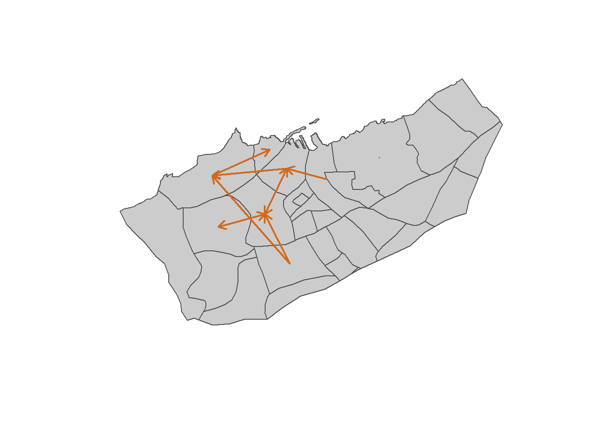
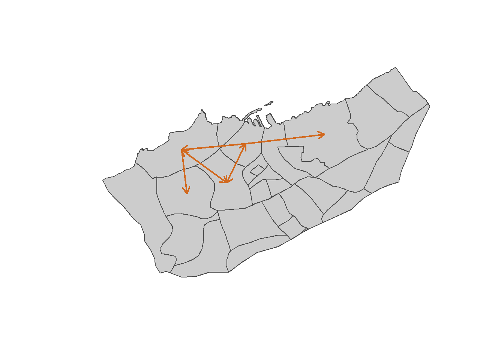
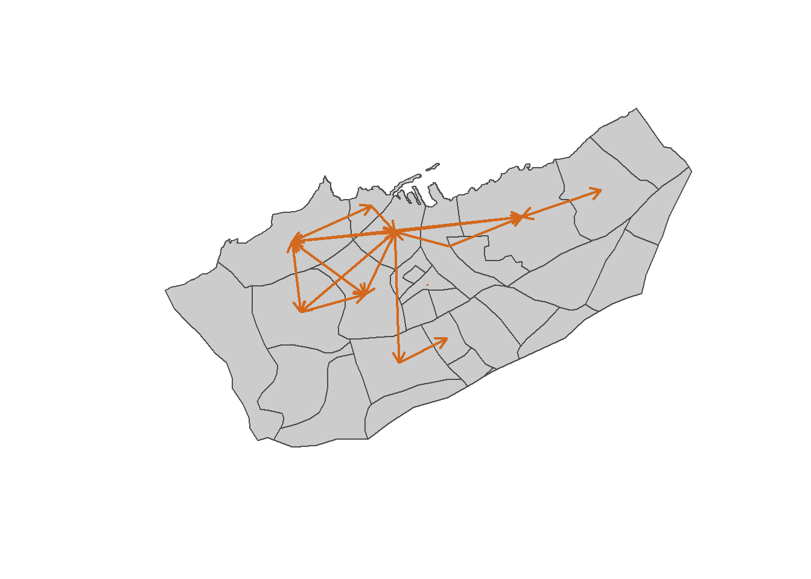
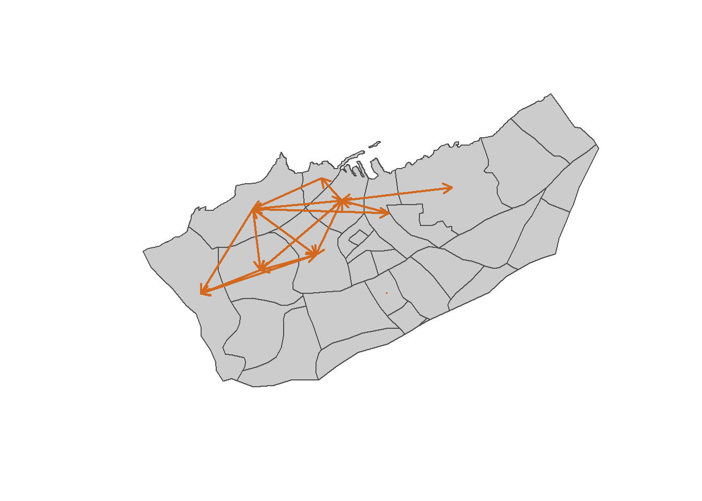
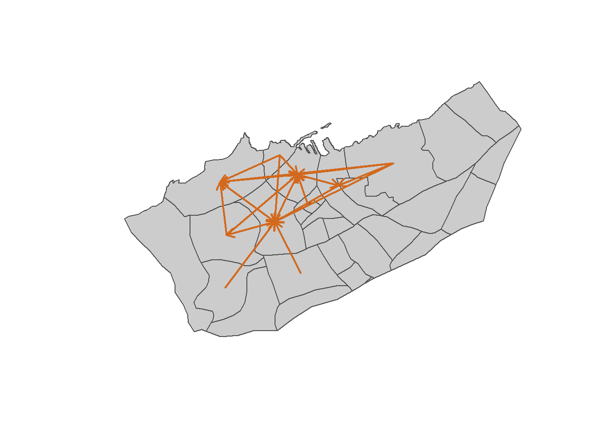
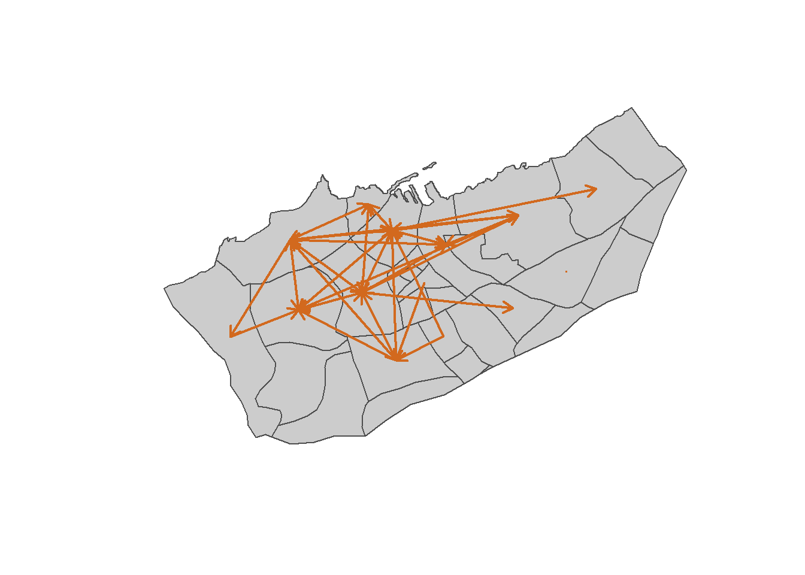
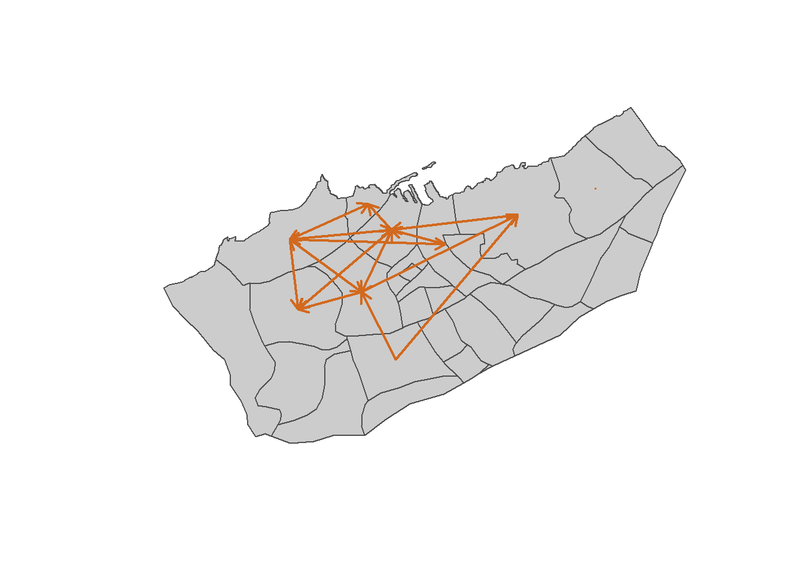
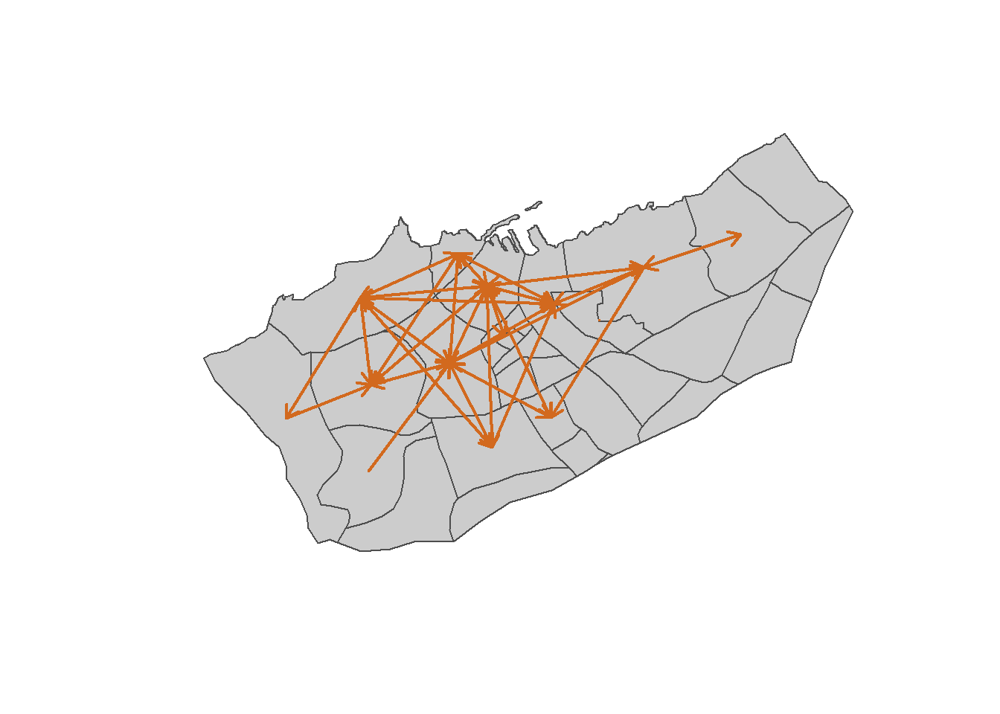

<!-- # Matrice Origine-Destination (OD) : Détermination des Flux -->
\newpage

## OD Journalière : Analyse des Déplacements par Jour

### Introduction
Dans cette tache l'objectif est d'obtenir la matrice de dependance pour un jour choisit. Pour visualiser les differents flux survenu au cours de differentes heures de la journée :

- Selectionner un jour 
- Creer la matrice de dépendance pour differents heures de la journée y compris l'heure de pointe
- Afficher la carte de flux pour les heures selectionnées

\newpage

### 1. Load packages

```R
library(dplyr) 
library(sf)
library(leaflet)
library(lubridate)
library(mapsf)
library(tidyr)
```

### 2. Load data 
```R
heetchPoints <-readRDS("DATA/heetchmarchcrop.Rds")
casaNeib <-st_read("DATA/casaneib.geojson") 
```

### 3. Projetion les objets spatiaux 
```R
casaNeibProj <-st_transform(casaNeib, crs=26191)
heetchPointsProj <-st_transform(heetchPoints, crs=26191)  

```

### 4. Créer la section du 1er Mars

Ici on fixe le jour au 1er Mars
```R
heetchPointsProj$Day <-day(heetchPointsProj$location_at_local_time)
heetchPointsProj$Hour <-hour(heetchPointsProj$location_at_local_time)
heetchM1Proj <-heetchPointsProj %>% 
  filter(Day==1)
```

### 5. Intersection des points x et des quartiers y

```R
casaNeibUnion <-st_union(casaNeibProj)
ptsInCasa <-st_contains(x=casaNeibUnion, y=heetchM1Proj)

selectPtsInCasa <-unlist(ptsInCasa)

heetchM1CropProj <-heetchM1Proj[selectPtsInCasa,]
ptsInNeib <-st_within(x=heetchM1Proj, y=casaNeibProj) %>% 
  unlist() 
heetchM1CropProj$NEIB <-ptsInNeib
```


### 6. Grouper par heure/ par identifiant chauffeur et par quartier

```R
nestedPts <-heetchM1CropProj %>% 
  st_drop_geometry() %>% 
  group_by(Hour,NEIB, driver_id) %>% 
  summarize(NBPTS=n())
```

### 7. Selectionner le quartier principal pour chaque chauffeur à chaque heure

```R
mainNeib <-nestedPts %>% 
  group_by(driver_id, Hour) %>% 
  arrange(desc(NBPTS)) %>% 
  slice(1)
```


### 8. Construire la matrice OD (origine-destination) pour le 1er Mars entre 7H et 8H du matin avec le nombre de drivers

```R
# mainNeibwide a comme colonne(driver_id, hours:00,01...)
mainNeibwide <-mainNeib %>% 
  select(driver_id,Hour,NEIB) %>% 
  pivot_wider(names_from=Hour, 
              values_from=NEIB,
              names_prefix="H",
              values_fill=NA)

OD78 <-mainNeibwide %>% 
  group_by(H7,H8) %>% 
  summarize(NB=n()) %>% 
  filter(!is.na(H7) & !is.na(H8))%>% 
  rename(ORI=H7, DES=H8)

OD78$ORINAME <-casaNeib$NAME_4[OD78$ORI]
OD78$DESNAME <-casaNeib$NAME_4[OD78$DES]

polCentroids <- st_centroid(casaNeibProj) # pour avoir les centroides
coordCentroids <-st_coordinates((polCentroids)) %>%as_data_frame()
# pour avoir les coordonnées des centroides
class(coordCentroids)

OD78$XORI <-coordCentroids$X[OD78$ORI]
OD78$XDES <-coordCentroids$X[OD78$DES]
OD78$YORI <-coordCentroids$Y[OD78$ORI]
OD78$YDES <-coordCentroids$Y[OD78$DES]

head(OD78)
```

**carte**

```R
selecFlows <-OD78 %>% filter(NB>2)
plot(casaNeibProj$geometry, col="grey80", border ="grey30")
arrows(selecFlows$XORI,
       selecFlows$YORI,
       selecFlows$XDES,
       selecFlows$YDES,
       col="chocolate",
       lwd=2,
       length=0.1,
       code=2)
```



### 9. Construire la matrice OD (origine-destination) pour le 1er Mars entre 12H et 13H du matin avec le nombre de drivers
```R
OD1213 <-mainNeibwide %>% 
  group_by(H12,H13) %>% 
  summarize(NB=n()) %>% 
  filter(!is.na(H12) & !is.na(H13))%>% 
  rename(ORI=H12, DES=H13)

OD1213$ORINAME <-casaNeib$NAME_4[OD1213$ORI]
OD1213$DESNAME <-casaNeib$NAME_4[OD1213$DES]

polCentroids <- st_centroid(casaNeibProj) # pour avoir les centroides
coordCentroids <-st_coordinates((polCentroids)) %>%as_data_frame()
# pour avoir les coordonnées des centroides
class(coordCentroids)

OD1213$XORI <-coordCentroids$X[OD1213$ORI]
OD1213$XDES <-coordCentroids$X[OD1213$DES]
OD1213$YORI <-coordCentroids$Y[OD1213$ORI]
OD1213$YDES <-coordCentroids$Y[OD1213$DES]

head(OD1213)
```

**carte**

```R
selecFlows <-OD1213 %>% filter(NB>2)
plot(casaNeibProj$geometry, col="grey80", border ="grey30")
arrows(selecFlows$XORI,
       selecFlows$YORI,
       selecFlows$XDES,
       selecFlows$YDES,
       col="chocolate",
       lwd=2,
       length=0.1,
       code=2)
```



### 10. Construire la matrice OD (origine-destination) pour le 1er Mars entre 18H et 19H du matin avec le nombre de drivers

```R
OD1819 <-mainNeibwide %>% 
  group_by(H18,H19) %>% 
  summarize(NB=n()) %>% 
  filter(!is.na(H18) & !is.na(H19))%>% 
  rename(ORI=H18, DES=H19)

OD1819$ORINAME <-casaNeib$NAME_4[OD1819$ORI]
OD1819$DESNAME <-casaNeib$NAME_4[OD1819$DES]

polCentroids <- st_centroid(casaNeibProj) # pour avoir les centroides
coordCentroids <-st_coordinates((polCentroids)) %>%as_data_frame()
# pour avoir les coordonnées des centroides
class(coordCentroids)

OD1819$XORI <-coordCentroids$X[OD1819$ORI]
OD1819$XDES <-coordCentroids$X[OD1819$DES]
OD1819$YORI <-coordCentroids$Y[OD1819$ORI]
OD1819$YDES <-coordCentroids$Y[OD1819$DES]

head(OD1819)
```

**carte**

```R
selecFlows <-OD1819 %>% filter(NB>2)
plot(casaNeibProj$geometry, col="grey80", border ="grey30")
arrows(selecFlows$XORI,
       selecFlows$YORI,
       selecFlows$XDES,
       selecFlows$YDES,
       col="chocolate",
       lwd=2,
       length=0.1,
       code=2)

```


### 11. Matrice OD (origine-destination) pour le 1er Mars entre 21H et 22H (heure de pointe) avec le nombre de drivers

```R
OD2122 <-mainNeibwide %>% 
  group_by(H21,H22) %>% 
  summarize(NB=n()) %>% 
  filter(!is.na(H21) & !is.na(H22))%>% 
  rename(ORI=H21, DES=H22)

OD2122$ORINAME <-casaNeib$NAME_4[OD2122$ORI]
OD2122$DESNAME <-casaNeib$NAME_4[OD2122$DES]

polCentroids <- st_centroid(casaNeibProj) # pour avoir les centroides
coordCentroids <-st_coordinates((polCentroids)) %>%as_data_frame()
# pour avoir les coordonnées des centroides
class(coordCentroids)

OD2122$XORI <-coordCentroids$X[OD2122$ORI]
OD2122$XDES <-coordCentroids$X[OD2122$DES]
OD2122$YORI <-coordCentroids$Y[OD2122$ORI]
OD2122$YDES <-coordCentroids$Y[OD2122$DES]

head(OD2122)
```

**carte**

```R
selecFlows <-OD2122 %>% filter(NB>2)
plot(casaNeibProj$geometry, col="grey80", border ="grey30")
arrows(selecFlows$XORI,
       selecFlows$YORI,
       selecFlows$XDES,
       selecFlows$YDES,
       col="chocolate",
       lwd=2,
       length=0.1,
       code=2)

```



### 12. Matrice OD (origine-destination) pour le 1er Mars entre 22H et 23H (1h apres heure de pointe) avec le nombre de drivers

```R
OD2223 <-mainNeibwide %>% 
  group_by(H22,H23) %>% 
  summarize(NB=n()) %>% 
  filter(!is.na(H22) & !is.na(H23))%>% 
  rename(ORI=H22, DES=H23)

OD2223$ORINAME <-casaNeib$NAME_4[OD2223$ORI]
OD2223$DESNAME <-casaNeib$NAME_4[OD2223$DES]

polCentroids <- st_centroid(casaNeibProj) # pour avoir les centroides
coordCentroids <-st_coordinates((polCentroids)) %>%as_data_frame()
# pour avoir les coordonnées des centroides
class(coordCentroids)

OD2223$XORI <-coordCentroids$X[OD2223$ORI]
OD2223$XDES <-coordCentroids$X[OD2223$DES]
OD2223$YORI <-coordCentroids$Y[OD2223$ORI]
OD2223$YDES <-coordCentroids$Y[OD2223$DES]

head(OD2223)
```

**carte**

```R
selecFlows <-OD2223 %>% filter(NB>2)
plot(casaNeibProj$geometry, col="grey80", border ="grey30")
arrows(selecFlows$XORI,
       selecFlows$YORI,
       selecFlows$XDES,
       selecFlows$YDES,
       col="chocolate",
       lwd=2,
       length=0.1,
       code=2)

```



### Conclusion
On constate à travers les differents graphique que le flux est plus important au tour de trois points comme on peut le voir sur le carte. Mais aussi que les flux deviennent de plus en plus important dans les heures du soir au alentour de 22H qui est donc veritablement l'heure de pointe.

\newpage

## OD Semaine vs Week-end : Comparaison des Déplacements

### Introduction

Dans cette tache on s'interesse aux differentes interactions survenu au cours d'une semaine pour les jours ouvrables (lundi-vendredi) comparativement au weekend (samedi,dimanche). On construit ainsi la matrice Origine-Destination (OD) pour les utlisateurs durants differents plage horaires de la journée. Puis on affiche pour chaque matrice construite les flux sur une carte.

\newpage

### 1. Load packages

```R
library(dplyr) 
library(sf)
library(leaflet)
library(lubridate)
library(mapsf)
library(tidyr)
```

### 2. Load data 

```R

heetchPoints <-readRDS("DATA/heetchmarchcrop.Rds")
casaNeib <-st_read("DATA/casaneib.geojson") 
```

### 3. Projetion les objets spatiaux

```R
  casaNeibProj <-st_transform(casaNeib, crs=26191)
  heetchPointsProj <-st_transform(heetchPoints, crs=26191)
```


### 4. Créer la section du 1er au 7 Mars (premiere semaine de Mars 2019) 


- Conversion Day, Hour, year 

```R 
heetchPointsProj$Day <-day(heetchPointsProj$location_at_local_time)
heetchPointsProj$Hour <-hour(heetchPointsProj$location_at_local_time)
heetchPointsProj$year <-year(heetchPointsProj$location_at_local_time)
```

#### 4.1 Jours ouvrable 1-5

```R

heetchM1ProjWeek <-heetchPointsProj %>% 
  filter(Day>0 & Day<6 )
class(heetchM1ProjWeek)

```

#### 4.2 jours du weekend 6-7 

```R

heetchM1ProjWeekend <-heetchPointsProj %>% 
  filter(Day>5 & Day<8 )
  
```

### 5. Intersection des points x et les quartiers y 

```R

casaNeibUnion <-st_union(casaNeibProj)

```

On compte de nombre de points par quartier pour jour ouvrable (week) et weekend

#### 5.1 week

```R

ptsInCasaWeek <-st_contains(x=casaNeibUnion, y=heetchM1ProjWeek)

selectPtsInCasaWeek <-unlist(ptsInCasaWeek)

heetchM1CropProjWeek <-heetchM1ProjWeek[selectPtsInCasaWeek,]
ptsInNeibWeek <-st_within(x=heetchM1ProjWeek, y=casaNeibProj) %>% 
  unlist() 

heetchM1CropProjWeek$NEIB <-ptsInNeibWeek
heetchM1CropProjWeek$NEIB <-ptsInNeibWeek

```

#### 5.1 weekend

```R

ptsInCasaWeekend <-st_contains(x=casaNeibUnion, y=heetchM1ProjWeekend)

selectPtsInCasaWeekend <-unlist(ptsInCasaWeekend)

heetchM1CropProjWeekend <-heetchM1ProjWeekend[selectPtsInCasaWeekend,]
ptsInNeibWeekend <-st_within(x=heetchM1ProjWeekend, y=casaNeibProj) %>% 
  unlist() 

heetchM1CropProjWeekend$NEIB <-ptsInNeibWeekend
heetchM1CropProjWeekend$NEIB <-ptsInNeibWeekend
```

### 6. Grouper par jour/heure/ par identifiant chauffeur et par quartier

#### 6.1 week

```R

nestedPtsWeek <-heetchM1CropProjWeek %>% 
  st_drop_geometry() %>% 
  group_by(Day,Hour,NEIB, driver_id) %>% 
  summarize(NBPTS=n())

```

#### 6.2 weekend

```R

nestedPtsWeekend <-heetchM1CropProjWeekend %>% 
  st_drop_geometry() %>% 
  group_by(Day,Hour,NEIB, driver_id) %>% 
  summarize(NBPTS=n())

```

### 7. Selectionner le quartier principal pour chaque chauffeur à chaque jour et heure

#### 7.1 week

```R

mainNeibWeek <-nestedPtsWeek %>% 
  group_by(Day, driver_id, Hour) %>% 
  arrange(desc(NBPTS)) %>% 
  slice(1)

```

#### 7.2 weekend

```R

mainNeibWeekend <-nestedPtsWeekend %>% 
  group_by(Day, driver_id, Hour) %>% 
  arrange(desc(NBPTS)) %>% 
  slice(1)

```
### 8. Construire la matrice OD (origine-destination) semaine du 1er au 7 Mars entre 7H et 8H du matin

#### 8.1 week

```R

mainNeibwideWeek <-mainNeibWeek %>% 
  select(driver_id,Day,Hour,NEIB) %>% 
  pivot_wider(names_from=Hour, 
              values_from=NEIB,
              names_prefix="H",
              values_fill=NA)

OD78Week <-mainNeibwideWeek %>% 
  group_by(H7,H8) %>% 
  summarize(NB=n()) %>% 
  filter(!is.na(H7) & !is.na(H8))%>% 
  rename(ORI=H7, DES=H8)

OD78Week$ORINAME <-casaNeib$NAME_4[OD78Week$ORI]
OD78Week$DESNAME <-casaNeib$NAME_4[OD78Week$DES]

polCentroids <- st_centroid(casaNeibProj) # pour avoir les centroides
coordCentroids <-st_coordinates((polCentroids)) %>%as_data_frame()
# pour avoir les coordonnées des centroides

class(coordCentroids)

OD78Week$XORI <-coordCentroids$X[OD78Week$ORI]
OD78Week$XDES <-coordCentroids$X[OD78Week$DES]
OD78Week$YORI <-coordCentroids$Y[OD78Week$ORI]
OD78Week$YDES <-coordCentroids$Y[OD78Week$DES]
```

- Afficher la carte week

```R

selecFlowsWeek <-OD78Week %>% filter(NB>2)
plot(casaNeibProj$geometry, col="grey80", border ="grey30")
arrows(selecFlowsWeek$XORI,
       selecFlowsWeek$YORI,
       selecFlowsWeek$XDES,
       selecFlowsWeek$YDES,
       col="chocolate",
       lwd=2,
       length=0.1,
       code=2)
```


#### 8.2 weekend

```R

mainNeibwideWeekend <-mainNeibWeekend %>% 
  select(driver_id,Day,Hour,NEIB) %>% 
  pivot_wider(names_from=Hour, 
              values_from=NEIB,
              names_prefix="H",
              values_fill=NA)

OD78Weekend <-mainNeibwideWeekend %>% 
  group_by(H7,H8) %>% 
  summarize(NB=n()) %>% 
  filter(!is.na(H7) & !is.na(H8))%>% 
  rename(ORI=H7, DES=H8)

OD78Weekend$ORINAME <-casaNeib$NAME_4[OD78Weekend$ORI]
OD78Weekend$DESNAME <-casaNeib$NAME_4[OD78Weekend$DES]

polCentroids <- st_centroid(casaNeibProj) # pour avoir les centroides
coordCentroids <-st_coordinates((polCentroids)) %>%as_data_frame()
# pour avoir les coordonnées des centroides
class(coordCentroids)

OD78Weekend$XORI <-coordCentroids$X[OD78Weekend$ORI]
OD78Weekend$XDES <-coordCentroids$X[OD78Weekend$DES]
OD78Weekend$YORI <-coordCentroids$Y[OD78Weekend$ORI]
OD78Weekend$YDES <-coordCentroids$Y[OD78Weekend$DES]

```

- Afficher la carte weekend

```R

selecFlowsWeekend <-OD78Weekend %>% filter(NB>2)
plot(casaNeibProj$geometry, col="grey80", border ="grey30")
arrows(selecFlowsWeekend$XORI,
       selecFlowsWeekend$YORI,
       selecFlowsWeekend$XDES,
       selecFlowsWeekend$YDES,
       col="chocolate",
       lwd=2,
       length=0.1,
       code=2)
```



### 9. Construire la matrice OD (origine-destination) semaine du 1er au 7 Mars entre 12H et 13H du matin

#### 9.1 Week

```R

OD1213Week <-mainNeibwideWeek %>% 
  group_by(H12,H13) %>% 
  summarize(NB=n()) %>% 
  filter(!is.na(H12) & !is.na(H13))%>% 
  rename(ORI=H12, DES=H13)

OD1213Week$ORINAME <-casaNeib$NAME_4[OD1213Week$ORI]
OD1213Week$DESNAME <-casaNeib$NAME_4[OD1213Week$DES]

polCentroids <- st_centroid(casaNeibProj) # pour avoir les centroides
coordCentroids <-st_coordinates((polCentroids)) %>%as_data_frame()
# pour avoir les coordonnées des centroides
class(coordCentroids)

OD1213Week$XORI <-coordCentroids$X[OD1213Week$ORI]
OD1213Week$XDES <-coordCentroids$X[OD1213Week$DES]
OD1213Week$YORI <-coordCentroids$Y[OD1213Week$ORI]
OD1213Week$YDES <-coordCentroids$Y[OD1213Week$DES]

```

- Afficher la carte week 12h -13h
```R

selecFlowsWeek <-OD1213Week %>% filter(NB>2)
plot(casaNeibProj$geometry, col="grey80", border ="grey30")
arrows(selecFlowsWeek$XORI,
       selecFlowsWeek$YORI,
       selecFlowsWeek$XDES,
       selecFlowsWeek$YDES,
       col="chocolate",
       lwd=2,
       length=0.1,
       code=2)
```



#### 9.2 Weekend

```R

OD1213Weekend <-mainNeibwideWeekend %>% 
  group_by(H12,H13) %>% 
  summarize(NB=n()) %>% 
  filter(!is.na(H12) & !is.na(H13))%>% 
  rename(ORI=H12, DES=H13)

OD1213Weekend$ORINAME <-casaNeib$NAME_4[OD1213Weekend$ORI]
OD1213Weekend$DESNAME <-casaNeib$NAME_4[OD1213Weekend$DES]

polCentroids <- st_centroid(casaNeibProj) # pour avoir les centroides
coordCentroids <-st_coordinates((polCentroids)) %>%as_data_frame()
# pour avoir les coordonnées des centroides
class(coordCentroids)

OD1213Weekend$XORI <-coordCentroids$X[OD1213Weekend$ORI]
OD1213Weekend$XDES <-coordCentroids$X[OD1213Weekend$DES]
OD1213Weekend$YORI <-coordCentroids$Y[OD1213Weekend$ORI]
OD1213Weekend$YDES <-coordCentroids$Y[OD1213Weekend$DES]
```

- Afficher la carte Weekend 12h -13h

```R

selecFlowsWeekend <-OD1213Weekend %>% filter(NB>2)
plot(casaNeibProj$geometry, col="grey80", border ="grey30")
arrows(selecFlowsWeekend$XORI,
       selecFlowsWeekend$YORI,
       selecFlowsWeekend$XDES,
       selecFlowsWeekend$YDES,
       col="chocolate",
       lwd=2,
       length=0.1,
       code=2)
```



### 10. Construire la matrice OD (origine-destination) semaine du 1er au 7 Mars entre 18H et 19H du matin

#### 10.1 Week

```R

OD1819Week <-mainNeibwideWeek %>% 
  group_by(H18,H19) %>% 
  summarize(NB=n()) %>% 
  filter(!is.na(H18) & !is.na(H19))%>% 
  rename(ORI=H18, DES=H19)

OD1819Week$ORINAME <-casaNeib$NAME_4[OD1819Week$ORI]
OD1819Week$DESNAME <-casaNeib$NAME_4[OD1819Week$DES]

polCentroids <- st_centroid(casaNeibProj) # pour avoir les centroides
coordCentroids <-st_coordinates((polCentroids)) %>%as_data_frame()
# pour avoir les coordonnées des centroides
class(coordCentroids)

OD1819Week$XORI <-coordCentroids$X[OD1819Week$ORI]
OD1819Week$XDES <-coordCentroids$X[OD1819Week$DES]
OD1819Week$YORI <-coordCentroids$Y[OD1819Week$ORI]
OD1819Week$YDES <-coordCentroids$Y[OD1819Week$DES]
```



- Afficher la carte Week

```R

selecFlowsWeek <-OD1819Week %>% filter(NB>2)
plot(casaNeibProj$geometry, col="grey80", border ="grey30")
arrows(selecFlowsWeek$XORI,
       selecFlowsWeek$YORI,
       selecFlowsWeek$XDES,
       selecFlowsWeek$YDES,
       col="chocolate",
       lwd=2,
       length=0.1,
       code=2)
```

#### 10.2 Weekend

```R

OD1819Weekend <-mainNeibwideWeekend %>% 
  group_by(H18,H19) %>% 
  summarize(NB=n()) %>% 
  filter(!is.na(H18) & !is.na(H19))%>% 
  rename(ORI=H18, DES=H19)

OD1819Weekend$ORINAME <-casaNeib$NAME_4[OD1819Weekend$ORI]
OD1819Weekend$DESNAME <-casaNeib$NAME_4[OD1819Weekend$DES]

polCentroids <- st_centroid(casaNeibProj) # pour avoir les centroides
coordCentroids <-st_coordinates((polCentroids)) %>%as_data_frame()
# pour avoir les coordonnées des centroides
class(coordCentroids)

OD1819Weekend$XORI <-coordCentroids$X[OD1819Weekend$ORI]
OD1819Weekend$XDES <-coordCentroids$X[OD1819Weekend$DES]
OD1819Weekend$YORI <-coordCentroids$Y[OD1819Weekend$ORI]
OD1819Weekend$YDES <-coordCentroids$Y[OD1819Weekend$DES]
```

- Afficher la carte Weekend 
```R

selecFlowsWeek <-OD1819Week %>% filter(NB>2)
plot(casaNeibProj$geometry, col="grey80", border ="grey30")
arrows(selecFlowsWeekend$XORI,
       selecFlowsWeekend$YORI,
       selecFlowsWeekend$XDES,
       selecFlowsWeekend$YDES,
       col="chocolate",
       lwd=2,
       length=0.1,
       code=2)

```


### Conclusion
Globalement on constate que les flux de circulation sont beaucoup plus important les jours ouvrables que les weekends.
